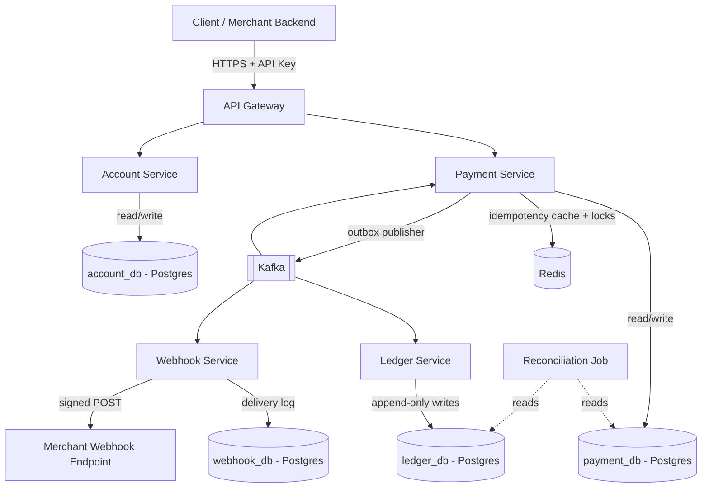
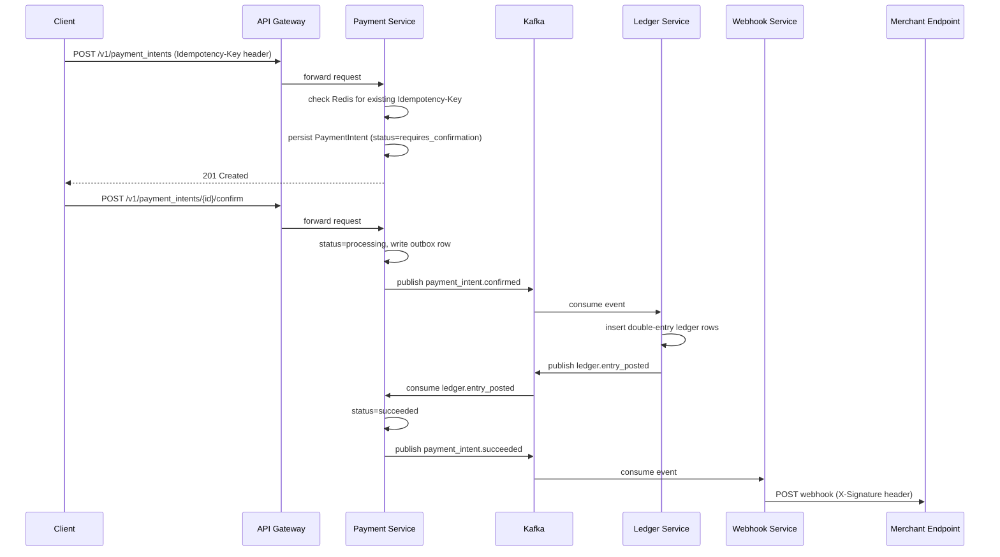

# Distributed Payment Processing System

A Java/Spring Boot microservices system that models how a payment processor like Stripe handles payment intents, ledger entries, and webhook delivery — built to understand the hard parts of distributed transaction processing, not to compete with an actual payment provider.


> **Status:** This is currently in the design phase. The architecture, API contracts, and data model below are the spec I'm building against, not a description of finished code. Services are being implemented incrementally — check the Issues/Projects tab for what's actually working at any point in time. I'm keeping this README ahead of the code on purpose: writing the contracts down first is what forces the hard decisions (idempotency, event ordering, ledger consistency) to happen before I'm three services deep and have to walk them back.

---

## Problem Statement

Most CRUD-app tutorials skip the part that actually makes payment systems hard. Calling a payment API once is easy. Calling it, having the response time out, and the client retrying — without charging the customer twice — is not. Neither is making sure a "successful" payment always has a matching ledger entry, even if the service that writes the ledger crashes two seconds after the payment service marks the transaction as complete.

This project is my attempt to build a small, honest version of that problem: a system where a payment intent moves through a defined lifecycle, money movements are recorded in an append-only ledger using double-entry accounting, and merchants get notified of state changes via webhooks — all while the services involved are independently deployable, can fail independently, and have to stay consistent anyway.

The goal isn't to reimplement Stripe's feature set. It's to reimplement Stripe's *shape* — the PaymentIntent state machine, idempotency keys on mutating requests, signed webhook events — because that shape is a good forcing function for distributed systems patterns that show up everywhere: outbox pattern, eventual consistency, saga-style choreography, and reconciliation as a first-class concern rather than an afterthought.

---

## Architecture

### High-level view

The system is split into five services behind an API gateway. Synchronous REST is used only where the client needs an immediate answer (creating a payment intent, reading its status). Everything that happens *because of* a state change — ledger postings, webhook delivery — happens asynchronously over Kafka.



### Service responsibilities

- **API Gateway** — single entry point, terminates TLS, authenticates merchant API keys, applies per-merchant rate limits, routes to downstream services. Built on Spring Cloud Gateway.
- **Payment Service** — owns the `PaymentIntent` lifecycle (`requires_confirmation → processing → succeeded/failed`). Validates idempotency keys, persists state transitions, and writes events to an outbox table that a relay process publishes to Kafka.
- **Account Service** — merchant accounts, API key issuance/hashing, and the balances merchants query. Balances are a read model fed by ledger events, not the source of truth.
- **Ledger Service** — the actual source of truth for money movement. Consumes payment events and writes immutable, double-entry rows (every entry has a matching debit and credit that net to zero). Never updates or deletes rows.
- **Webhook Service** — consumes domain events and delivers them to merchant-configured endpoints with HMAC signatures, retries with exponential backoff, and a delivery log so merchants can replay missed events.
- **Reconciliation Job** — a scheduled batch process (not user-facing) that compares Payment Service state against Ledger Service entries and flags drift. This is the safety net for the eventual-consistency model described below.

### Payment lifecycle (sequence)



### Repository layout

```
distributed-payment-processing-system/
├── services/
│   ├── api-gateway/
│   ├── payment-service/
│   ├── account-service/
│   ├── ledger-service/
│   └── webhook-service/
├── libs/
│   └── common/                # shared event schemas, error model, idempotency utilities
├── infra/
│   ├── docker-compose.yml
│   └── init/                  # per-service DB init scripts
├── docs/
│   └── openapi/               # OpenAPI specs per service
└── README.md
```

---

## Design Decisions

**Resource-oriented API modeled on PaymentIntents.** Rather than a generic `/payments` endpoint that does everything in one call, the API exposes a `PaymentIntent` resource that moves through explicit states. This mirrors how Stripe's API works and forces the client (and the implementation) to handle the fact that a payment isn't a single atomic action — it's a process with checkpoints.

**Outbox pattern for event publishing, not direct Kafka writes from request handlers.** If the Payment Service wrote to Postgres *and* published to Kafka in the same request, a crash between those two operations would leave the system in an inconsistent state with no way to detect it. Instead, the state change and an "event to publish" row are written in the same database transaction, and a separate relay process (Debezium-style CDC, or a polling publisher to start) reads the outbox table and publishes to Kafka. This trades a small amount of latency for the guarantee that an event is published if and only if the state change committed.

**The ledger is append-only and is the actual source of truth for money.** Account balances are not columns that get incremented — they're computed (or materialized as a cache) from the sum of ledger entries. Every financial event produces a balanced pair of entries (a debit and a credit). This is slower to query but means you can always answer "how did this balance get to this number" by reading history, and it makes the reconciliation job possible in the first place.

**Idempotency keys live in Redis with a Postgres backstop.** The client-supplied `Idempotency-Key` header is checked against Redis first (fast path, short TTL) and against a unique constraint on `(merchant_id, idempotency_key)` in Postgres (durable path). Redis being unavailable degrades to "slightly slower, still correct" rather than "duplicate charges possible."

**Database-per-service, with a pragmatic caveat for local development.** In the target design, each service owns its schema and no service queries another's tables directly — communication is via API calls or events. Locally, all five databases run as separate logical databases inside one Postgres container (one `docker-compose` service, multiple `CREATE DATABASE` statements in the init script) to keep the dev environment lightweight. The boundary in the code is real even though the container boundary isn't, yet.

**Microservices here is a deliberate overcorrection for a learning project.** I talk about this more under Tradeoffs, but it's worth saying up front: if this were a real product at this stage, a modular monolith would almost certainly be the right call. I'm choosing the more expensive architecture because the point of the project is to practice the patterns that only show up once you have network boundaries between components that need to agree on the state of money.

---

## Features

**Core (MVP scope):**
- PaymentIntent lifecycle: create, confirm, cancel, with explicit status transitions
- Idempotent request handling via `Idempotency-Key` header (Redis + Postgres unique constraint)
- Double-entry ledger with immutable entries and computed/materialized balances
- Outbox-based event publishing from Payment Service to Kafka
- Webhook delivery with HMAC-SHA256 signed payloads, retry with backoff, and a delivery log
- Merchant API key issuance and authentication at the gateway
- Reconciliation job comparing Payment Service and Ledger Service state, flagging mismatches
- Dockerized local environment (Postgres, Kafka, Redis, all services) via `docker compose`

**Explicitly out of scope for now (see Future Improvements):**
- Real card data handling of any kind — this system never sees or stores PANs
- Multi-currency / FX
- Fraud or risk scoring
- A UI of any kind

---

## Tech Stack

| Layer | Choice | Notes |
|---|---|---|
| Language | Java 21 | LTS, virtual threads available if Kafka consumer throughput needs it later |
| Framework | Spring Boot 3.x | Spring Web (REST), Spring Data JPA, Spring Kafka |
| Gateway | Spring Cloud Gateway | Routing, API key auth filter, rate limiting |
| Database | PostgreSQL 16 | One logical database per service |
| Migrations | Flyway | Versioned SQL migrations per service |
| Cache / Locks | Redis 7 | Idempotency keys, short-lived locks, hot-path balance cache |
| Messaging | Apache Kafka (KRaft mode) | Domain events, no Zookeeper dependency |
| Containerization | Docker, Docker Compose | Single-command local environment |
| API docs | springdoc-openapi | Generated OpenAPI 3 specs per service |
| Testing | JUnit 5, Mockito, Testcontainers | Integration tests run against real Postgres/Kafka/Redis in containers |
| Build | Maven (multi-module) | Shared `libs/common` module for event schemas and DTOs |

---

## Quick Start

```bash
git clone https://github.com/Dasari-Karthikeya/Distributed-Payment-Processing-System.git
cd Distributed-Payment-Processing-System

# Brings up Postgres, Kafka, Redis, and all services
docker compose -f infra/docker-compose.yml up -d --build

# Wait for health checks, then create a payment intent
curl -X POST http://localhost:8080/v1/payment_intents \
  -H "Authorization: Bearer sk_test_xxxxxxxx" \
  -H "Idempotency-Key: 4f2a6b1e-7c3d-4e9a-9b2f-1234567890ab" \
  -H "Content-Type: application/json" \
  -d '{
        "amount": 2500,
        "currency": "usd",
        "payment_method": "pm_card_visa_token"
      }'
```

A successful response returns a `PaymentIntent` in `requires_confirmation` state. Confirming it kicks off the flow shown in the sequence diagram above.

---

## Local Development

**Prerequisites:** JDK 21, Maven 3.9+, Docker, Docker Compose v2.

Each service is a separate Maven module under `services/`, sharing common types from `libs/common`.

```bash
# Build everything
mvn -pl libs/common -am install
mvn -pl services/payment-service -am package

# Run infra only (Postgres, Kafka, Redis) so you can run a service from your IDE
docker compose -f infra/docker-compose.yml up -d postgres kafka redis

# Run a service locally against that infra
cd services/payment-service
mvn spring-boot:run -Dspring-boot.run.profiles=local
```

**Environment variables (per service, `.env` or Spring profile):**

| Variable | Purpose | Example |
|---|---|---|
| `DB_URL` | JDBC connection string | `jdbc:postgresql://localhost:5432/payment_db` |
| `DB_USERNAME` / `DB_PASSWORD` | DB credentials | — |
| `KAFKA_BOOTSTRAP_SERVERS` | Kafka broker address | `localhost:9092` |
| `REDIS_HOST` / `REDIS_PORT` | Redis connection | `localhost` / `6379` |
| `WEBHOOK_SIGNING_SECRET` | Per-merchant HMAC secret seed | (generated at merchant onboarding) |

Database migrations run automatically on startup via Flyway in the `local` and `dev` profiles. For `prod`, migrations are expected to run as a separate CI step before the new service version is deployed.

---

## API Documentation

Each service exposes its own OpenAPI spec at `/v3/api-docs` (Swagger UI at `/swagger-ui.html`) once running. The gateway aggregates these under `/docs`. Below are the core contracts as currently specced.

### Create a PaymentIntent

```
POST /v1/payment_intents
Authorization: Bearer <merchant_api_key>
Idempotency-Key: <uuid>
```

```json
{
  "amount": 2500,
  "currency": "usd",
  "payment_method": "pm_card_visa_token",
  "description": "Order #4471"
}
```

Response `201 Created`:

```json
{
  "id": "pi_3f9a2b7c1e4d",
  "object": "payment_intent",
  "amount": 2500,
  "currency": "usd",
  "status": "requires_confirmation",
  "created": 1750000000
}
```

### Confirm a PaymentIntent

```
POST /v1/payment_intents/{id}/confirm
Authorization: Bearer <merchant_api_key>
```

Transitions `requires_confirmation → processing → succeeded` (or `failed`). The response on success returns `status: "succeeded"` once the ledger has acknowledged the posting — the client-facing call blocks on that internal round trip via Kafka, bounded by a timeout (see Performance).

### Webhook event payload

```json
{
  "id": "evt_8b1c4d2a",
  "type": "payment_intent.succeeded",
  "created": 1750000005,
  "data": {
    "object": {
      "id": "pi_3f9a2b7c1e4d",
      "status": "succeeded",
      "amount": 2500,
      "currency": "usd"
    }
  }
}
```

Each webhook request includes an `X-Signature` header: `HMAC-SHA256(timestamp + "." + body, merchant_webhook_secret)`, hex-encoded, with the timestamp also sent as `X-Signature-Timestamp` so the receiver can reject stale requests (replay protection).

---

## Performance

No load testing has been run yet — this section describes targets and known pressure points, which I'll validate once the MVP services are wired together.

**Targets for the MVP:**
- `POST /v1/payment_intents` (create): p99 under 100ms — single-table insert plus an idempotency check, no cross-service calls.
- `POST /v1/payment_intents/{id}/confirm`: p99 under 1s — this is the call that waits on the Payment → Ledger → Payment round trip over Kafka, so it's inherently slower and bounded by a server-side timeout that falls back to "processing" with an async webhook for the final state.

**Known bottlenecks and mitigations:**
- **Ledger writes are naturally serialized per account.** Two concurrent transactions against the same account need their ledger entries applied in a consistent order. Kafka topics for ledger events are partitioned by `account_id`, so all events for a given account are processed in order by a single consumer instance — this avoids row-level lock contention turning into a queue, at the cost of per-account (not global) throughput limits.
- **The confirm endpoint's synchronous wait on an async round trip is the main latency risk.** If the Ledger Service is slow or Kafka has consumer lag, this call gets slow. The fallback is to return `processing` immediately past a short timeout and let the webhook carry the final status — this is the same pattern Stripe uses for payment methods that don't resolve instantly.
- **Plan for load testing:** k6 or Gatling scripts against the gateway, run inside `docker compose`, targeting the create/confirm endpoints with realistic idempotency key reuse (to exercise the Redis fast path) and cold keys (to exercise the Postgres fallback).

---

## Testing

- **Unit tests** (JUnit 5 + Mockito) cover business logic per service — state machine transitions in Payment Service, ledger balancing rules in Ledger Service, signature generation in Webhook Service.
- **Integration tests** use Testcontainers to spin up real Postgres, Kafka, and Redis instances per test class. No mocking the database or the broker for anything that touches persistence or messaging — this is where most of the bugs in a system like this actually live.
- **Cross-service flow tests** run against `docker compose` and exercise the full sequence from the diagram above: create → confirm → assert ledger entries exist → assert webhook was delivered (using a local test HTTP server as the "merchant endpoint").
- **Reconciliation job tests** seed deliberately mismatched Payment/Ledger state and assert the job detects and reports it — this job is the safety net for the whole eventual-consistency design, so it gets tested as carefully as the happy path.

Target coverage for business-logic packages (state machines, ledger posting rules, signature/idempotency utilities) is 80%+. Coverage on framework glue (controllers, repositories) is not a goal in itself.

---

## Security

- **Authentication** is via merchant API keys (`sk_test_...` / `sk_live_...` style), hashed at rest, checked at the gateway before a request reaches any service.
- **Webhooks are signed** with HMAC-SHA256 using a per-merchant secret, with a timestamp included to allow receivers to reject replayed requests.
- **No raw card data ever enters this system.** Payment methods are referenced by opaque tokens (`pm_...`), simulating the boundary where a real implementation would hand off to a PCI-compliant vault/processor. This project is explicitly **not** PCI-DSS scoped and should never be fed real card numbers.
- **Rate limiting** at the gateway is per API key, using Redis-backed counters (token bucket), to contain abuse and runaway retry loops from a single integration.
- **The ledger is immutable and append-only** — there is no `UPDATE` or `DELETE` path on ledger entries, by design and by database permissions. Corrections are made via new offsetting entries, never by editing history.
- **Secrets** (DB credentials, Kafka credentials, webhook signing keys) are environment variables locally and would move to a secrets manager (Vault, AWS Secrets Manager, etc.) before any non-local deployment — none are committed, and `.env.example` files contain placeholders only.

---

## Deployment

- **Local:** `docker compose -f infra/docker-compose.yml up`. This is the only supported environment right now.
- **CI (planned):** GitHub Actions pipeline running `mvn verify` (unit + Testcontainers integration tests) on every PR, then building and pushing per-service Docker images on merge to `main`.
- **Target deployment (planned):** Kubernetes, one Deployment + Service per microservice, with Kafka and Postgres run as managed services rather than in-cluster. Helm charts will live under `infra/helm/` once the service set stabilizes — I'm deliberately not building this until the service boundaries have proven themselves locally, since redrawing them after writing Helm charts for five services is more painful than redrawing them before.
- **Configuration** follows standard Spring profiles (`local`, `dev`, `prod`) with environment-variable overrides for anything environment-specific (connection strings, broker addresses, secrets).

---

## Operational Concerns

- **Health checks** via Spring Boot Actuator — `/actuator/health/liveness` and `/actuator/health/readiness` per service, used for container orchestration restart/traffic decisions.
- **Structured logging** in JSON, with a correlation ID generated at the gateway and propagated through HTTP headers and Kafka message headers, so a single payment intent's path through all five services can be traced from logs alone before any tracing infrastructure exists.
- **Dead-letter handling:** Kafka consumers that fail repeatedly on a message route it to a `<topic>.DLT` topic rather than blocking the partition; DLT topics are monitored (alerting is a future item — see below).
- **The reconciliation job** is the primary operational signal for "is the system actually consistent right now." It runs on a schedule, compares Payment Service status against Ledger Service postings for the same period, and writes discrepancies to a dedicated table for review. In a production system this would page someone; here it's a report.
- **Graceful shutdown:** services finish in-flight Kafka consumer batches and let active HTTP requests complete before terminating, to avoid partial writes during deploys.

---

## Tradeoffs

**Microservices for a project this size is overkill, and that's intentional — but it's worth being honest about the cost.** Five services means five databases to migrate, five sets of configuration, and a local environment that takes longer to start than a single Spring Boot app would. The payoff is that the patterns I actually wanted to practice — outbox-based event publishing, saga-style state reconciliation across service boundaries, idempotency under concurrent retries — don't really exist in a monolith. If I were building a payment system for an actual business at this scale, I'd start with a modular monolith (same package boundaries, same domain separation, one deployable) and split services out only when a specific one needed to scale or deploy independently. This project optimizes for the former lesson, not for shipping speed.

**Kafka over a simpler broker (e.g., RabbitMQ) adds real operational weight** — even in KRaft mode without Zookeeper, it's a heavier piece of infrastructure than a queue. I chose it because the replay/retention semantics matter for the reconciliation story: being able to replay `ledger.entry_posted` events to rebuild a read model, or to recover a consumer that fell behind, is part of what I'm trying to learn. A simpler queue would be the more defensible choice for an MVP-stage product.

**Eventual consistency between Payment Service and Ledger Service, rather than a distributed transaction.** A two-phase commit across service boundaries would give stronger guarantees but couples the services' availability together and is generally considered an anti-pattern at this scale for good reason. Instead, the system accepts a short window where a `PaymentIntent` can be `processing` while its ledger entries haven't landed yet, and relies on the outbox pattern plus the reconciliation job to guarantee the window closes and any failure to close it is detected. The tradeoff is operational: "detected and reported" is weaker than "impossible," and the reconciliation job becomes a critical piece of infrastructure rather than a nice-to-have.

**Database-per-service makes reporting harder.** "Show me all payments and their ledger status for merchant X" now requires joining across service boundaries, which you can't do with SQL anymore. The honest answer for a real system is a dedicated reporting/read-model service that consumes events from both Payment and Ledger and maintains a denormalized view — that's listed under Future Improvements rather than built now, because building it before the source services are stable means rebuilding it once they change.

---

## Future Improvements

- Reporting/read-model service (CQRS-style) to support cross-service queries without joining across service boundaries
- Distributed tracing (OpenTelemetry + Jaeger) to replace the correlation-ID-in-logs approach
- Fraud/risk scoring service as an additional step before `confirm` completes
- Multi-currency support and FX rate handling in the ledger
- Kubernetes manifests / Helm charts and a CI/CD pipeline (GitHub Actions)
- Per-merchant rate-limit tiers instead of a flat limit
- Additional payment method types (bank transfers, wallets) — the `PaymentIntent` model is designed to support this, but only card-token flows are speced for the MVP
- Chaos testing (killing services/brokers mid-flow) to validate the reconciliation job actually catches what it's supposed to

---

## Contributing

This started as a personal project to work through distributed-systems patterns in a financial context, but issues and PRs are welcome — especially around the event schemas in `libs/common`, since those are the contracts everything else depends on and are worth getting right early.

If you want to contribute:
1. Open an issue describing the change before a large PR — especially for anything touching the ledger model or event schemas.
2. Branch from `main` using `feature/<short-description>` or `fix/<short-description>`.
3. New business logic should come with unit tests; anything touching persistence or messaging should come with a Testcontainers integration test.
4. `mvn verify` should pass locally before opening a PR.

---

## License

Licensed under the MIT License. See [`LICENSE`](./LICENSE) for the full text.
